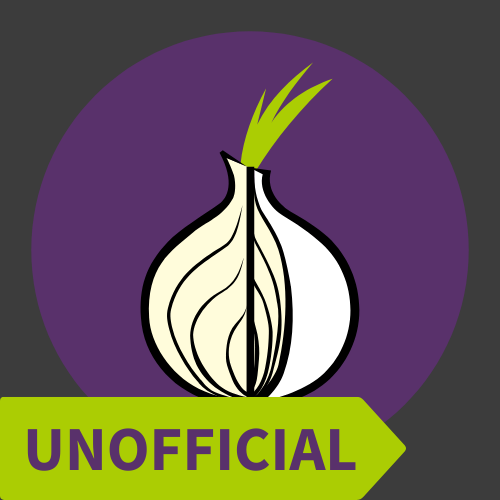
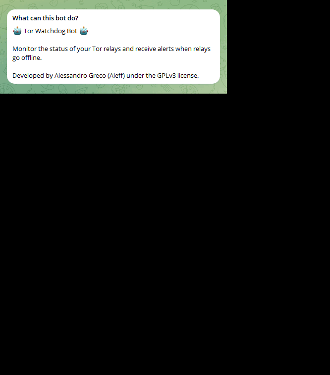

# Tor Watchdog Bot

Tor Watchdog Bot is a Telegram bot designed to monitor the status of Tor relays and notify users when relays go offline.

> Currently, the bot is reported as reachable but not usable due to security reasons towards users. The currently active backend refers to the demo.py file and not the main.py file. Feel free to download, modify, test and use the published code, as it has been released under the GPLv3 license.



## Features

- **Relay Status Monitoring**: The bot regularly checks the status of Tor relays to ensure they are online.
- **Alert Notifications**: Users receive instant notifications when one of their Tor relays goes offline.
- **Simple Interface**: Easy-to-use commands make it simple for users to add, remove, and list Tor relays.



## Usage

To get started, simply [start the bot](https://t.me/TorWatchdogBot) and use the following commands (by clicking the buttons):

- `/start`: Initialize the bot and register your Telegram ID.
- `"[+] Node"`: Add a Tor relay to monitor. The bot will prompt you to enter the relay's fingerprint.
- `"[-] Node"`: Remove a Tor relay from monitoring. The bot will prompt you to enter the relay's fingerprint.
- `"List Nodes"`: List all Tor relays currently being monitored.
- `"Status Nodes"`: Check the status of all monitored Tor relays.

## Installation

1. Clone this repository to your local machine:

    ```bash
    git clone https://github.com/aleff-github/TorWatchdog.git
    ```

2. Install the required Python packages:

    ```bash
    pip install -r requirements.txt
    ```

3. Obtain a Telegram Bot Token from BotFather and replace `your_telegram_token_here` in `config.ini` with your token.

4. Run the bot:

    ```bash
    python bot.py
    ```

## About

Tor Watchdog Bot was developed by Alessandro Greco (Aleff) and released under the GPLv3 license.

For any questions, feedback, or inquiries, feel free to contact via e-mail or Signal

Happy Hacking! 🛡️
